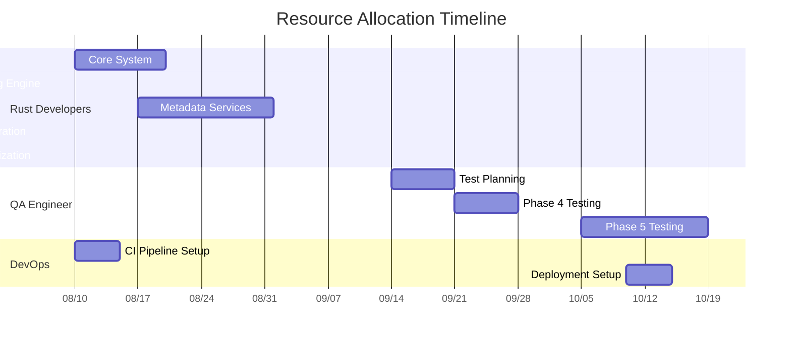

# Resource Allocation and Parallel Execution Plan

## Resource Optimization Strategy

## Parallel Execution Breakdown

### Phase 1: Core System (2025-08-10 to 2025-08-21)
- **Both Rust Developers**:
  - Developer 1: Project setup + configuration management
  - Developer 2: Data modeling + error handling
- **DevOps Support**: CI pipeline setup (first 5 days)

### Phase 2: Scraping Engine (2025-08-22 to 2025-09-12)
- **Developer 1**: Headless browser implementation
- **Developer 2**: Login flows + history extraction
- **QA Engineer**: Preparing test cases

### Phase 3: Metadata Services (2025-08-29 to 2025-09-26)
- **Developer 2**: API client framework (starts early)
- **Developer 1**: Service integrations (after scraping)
- **QA Engineer**: API mock server setup

### Phase 4: Integration (2025-09-27 to 2025-10-06)
- **Both Developers**: Pipeline implementation
- **QA Engineer**: Full integration testing
- **DevOps**: Monitoring setup

### Phase 5: Optimization (2025-10-07 to 2025-10-18)
- **Developer 1**: Performance tuning
- **Developer 2**: Reliability enhancements
- **QA Engineer**: Cross-platform testing
- **DevOps**: Deployment automation

## Efficiency Gains
1. **Phase Overlapping**: 2.5 weeks saved by parallelizing Metadata Services with Scraping Engine
2. **Resource Shifting**: DevOps only engaged during critical setup phases
3. **QA Staggering**: Testing prep overlaps with development phases
4. **Total Timeline**: 10 weeks (reduced from initial 11.5 weeks)

## Contingency Plan
- If phase delays occur:
  - Weekend rotations for critical path items
  - Temporary DevOps support for developer tasks
  - Focus on core functionality first