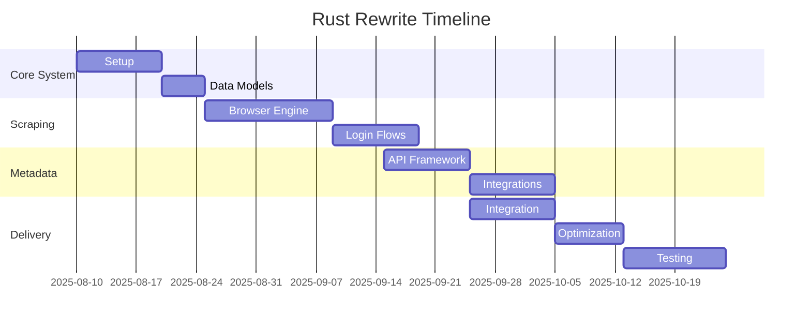

# Prime Video to Simkl CSV Exporter - Rust Rewrite Plan

## 1. Executive Summary
- **Objective**: Rewrite existing JavaScript implementation in Rust for improved reliability, performance, and maintainability
- **Key Benefits**:
  - 3-5x performance improvement
  - Memory safety guarantees
  - Better error handling and recovery
  - Reduced dependency vulnerabilities
- **Feature Parity**: Maintain all existing functionality while enhancing metadata processing

## 2. Migration Approach
**Phased Rewrite Strategy**:


## 3. Detailed Implementation Plan

### Phase 1: Core System (2 weeks)
- [ ] **Rust Project Setup**
  - Initialize Cargo workspace
  - Configure logging (tracing crate)
  - Implement configuration management (config-rs)
- [ ] **Data Model Design**
  - Define structs for:
    - `WatchHistoryItem`
    - `MetadataResult`
    - `CsvExport`
- [ ] **Error Handling Framework**
  - Create custom error types
  - Implement error chaining and recovery

### Phase 2: Scraping Engine (3 weeks)
- [ ] **Headless Browser Implementation**
  - Use Fantoccini crate (WebDriver interface)
  - Implement smart navigation with retry logic
- [ ] **Login Flow**
  - Modular authentication handlers:
    - Manual login with user interaction
    - Automated login (credentials from config)
    - 2FA handling
- [ ] **History Extraction**
  - Virtual scrolling implementation
  - DOM parsing with scraper crate
  - Date localization handling

### Phase 3: Metadata Services (3 weeks)
- [ ] **API Client Framework**
  - Generic API client with:
    - Rate limiting
    - Retry mechanisms
    - Caching
- [ ] **Service Integrations**:
  ```rust
  impl MetadataProvider for SimklClient {
      fn fetch(&self, title: &str, media_type: MediaType) -> Result<Metadata> {
          // Implementation
      }
  }
  ```
- [ ] **Priority-based Fallback System**
  - Configurable provider order
  - Smart result merging

### Phase 4: Integration (2 weeks)
- [ ] **Processing Pipeline**
  - Parallel processing with Rayon
  - Batch processing for large histories
- [ ] **CSV Generation**
  - Use csv crate with streaming writer
  - Automatic output file rotation
- [ ] **Configuration Bridge**
  - JavaScript to Rust config migration tool

### Phase 5: Optimization (1.5 weeks)
- [ ] **Performance Tuning**
  - Async I/O with Tokio
  - Memory usage optimization
- [ ] **Reliability Enhancements**
  - Transactional processing
  - State recovery system
- [ ] **Cross-platform Testing**
  - Windows, macOS, Linux verification

## 4. Testing Strategy
**Testing Pyramid**:
- Unit Tests: 60% coverage (modules)
- Integration Tests: 30% (component interactions)
- E2E Tests: 10% (full workflow)

**Key Test Scenarios**:
1. Authentication failure recovery
2. Large history processing (10k+ items)
3. API rate limit handling
4. Localized date parsing
5. Output validation against Simkl requirements

## 5. Risk Mitigation
| Risk | Mitigation Strategy | Owner |
|------|---------------------|-------|
| Puppeteer to Rust scraping parity | Phase 2 prototype validation | Lead Engineer |
| API dependency changes | Abstract client interfaces | Backend Team |
| Cross-platform issues | Early CI pipeline setup | DevOps |
| Performance bottlenecks | Load testing at each phase | QA Team |

## 6. Timeline & Resources


**Resource Requirements**:
- 2 Rust Developers (8 weeks)
- 1 QA Engineer (4 weeks)
- DevOps Support (2 weeks)

## 7. Data Migration
- **Approach**: Dual-write during transition period
- **Validation**:
  - Checksum comparison of CSV outputs
  - Statistical sampling of metadata accuracy
- **Fallback**: Maintain JS version until Rust implementation reaches 100% parity

## 8. Success Metrics
1. 50% reduction in memory usage
2. 3x faster processing for large histories
3. 99.5% success rate for full workflow
4. Zero crashes in 30-day stress test